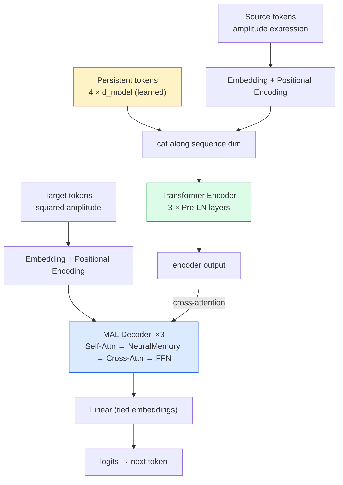
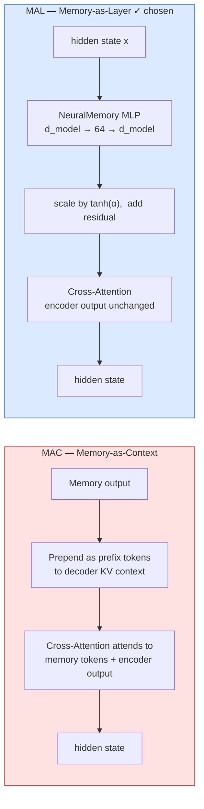
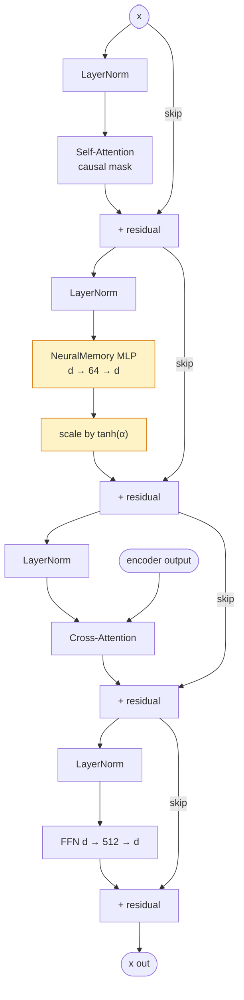

# Architecture & Design Rationale

## SYMBA GSoC 2026, Project 3.4 — Anmol Sen

This document explains every significant design decision in the three notebooks: why
each choice was made, what alternatives were considered, and what evidence justifies the
final design.

---

## §1 — Data Pipeline & Tokenization

### The Index Normalization Problem

The SYMBA dataset is generated by a Feynman diagram calculator that assigns arbitrary
integer suffixes to intermediate quantities: `%gam_17`, `%gam_304`, `k_43`, `%C_185`,
etc. These integers grow over the course of generation and carry no semantic meaning —
`%gam_17` and `%gam_304` in two different samples represent the same algebraic object.

Without normalization, a vocabulary built from raw amplitudes would need thousands of
`%gam_N` tokens, most seen only once. A model trained on such a vocabulary cannot
generalize — it would memorize arbitrary index patterns rather than learning the
underlying algebraic structure.

**Solution:** A deterministic left-to-right scan replaces each unique arbitrary index
with `IDX_0`, `IDX_1`, ... in encounter order. The same algebraic structure in two
different samples now tokenizes identically.

```
Raw:  gamma_{+%\sigma_249, %gam_165, %del_165} * gamma_{%\sigma_249, %gam_166, %del_166}
Norm: gamma_{+IDX_0, IDX_1, IDX_2} * gamma_{IDX_0, IDX_3, IDX_4}
```

This was validated by `dataset_analysis.py`: the highest arbitrary index observed across
all 594 samples is 119, so `IDX_0…IDX_119` (120 tokens) guarantees zero UNK. The
tokenizer uses `max_idx=120` with 8 tokens of headroom.

**Crucially, squared amplitudes contain zero arbitrary indices** (verified by assertion
in NB1) — normalization applies only to amplitude inputs, not targets.

---

### Why Not BPE or SentencePiece?

Byte-Pair Encoding and similar subword algorithms optimize for compression of natural
language corpora. Applied to physics expressions they produce destructive splits:

| Expression | BPE result | Problem |
|---|---|---|
| `s_12` | `s`, `_`, `12` | Mandelstam variable split across 3 tokens |
| `m_mu` | `m`, `_`, `mu` | Muon mass loses identity |
| `reg_prop` | `reg`, `_`, `prop` | Propagator regularizer fragmented |
| `IDX_0` | `ID`, `X_`, `0` | Normalized index destroyed |
| `gamma` | `ga`, `mma` | Dirac matrix operator split |

Each of these is an **atomic semantic unit** in QFT notation. Splitting them forces the
model to learn reassembly before it can do physics, wasting capacity and introducing
spurious ambiguities (`m` alone could be anything).

**The custom tokenizer** uses a greedy longest-match regex. Tokens are sorted by
descending length so `m_mu` is matched before `m`, `reg_prop` before `reg`, and
`IDX_119` before `IDX_11`. This achieves:
- **0 UNK tokens** across all 294,174 tokens in the full dataset
- **192 tokens total** — compact, closed vocabulary with exact semantic granularity
- **Lossless round-trip**: encode → decode → retokenize produces identical token sequence

---

### Vocabulary Composition (192 tokens)

| Category | Count | Examples |
|---|---|---|
| Special | 4 | `<PAD>`, `<SOS>`, `<EOS>`, `<UNK>` |
| Masses | 8 | `m_e`, `m_mu`, `m_u`, `m_d`, `m_s`, `m_t`, `m_b`, `m_c` |
| Mandelstam | 6 | `s_12`, `s_13`, `s_14`, `s_23`, `s_24`, `s_34` |
| Momenta | 4 | `p_1`, `p_2`, `p_3`, `p_4` |
| Numbers | 24 | `1/144`, `1/36`, ..., `16`, `-2`, `-1`, `0`–`9` |
| Physics ops | 3 | `gamma`, `reg_prop`, `i` |
| Coupling | 2 | `e`, `g` |
| Particles | 13 | `mu`, `tt`, `T`, `G`, `A`, `u`, `v`, `d`, `s`, `t`, `b`, `c` |
| Operators | 11 | `*`, `+`, `-`, `/`, `^`, `(`, `)`, `{`, `}`, `,`, `_` |
| IDX tokens | 120 | `IDX_0` … `IDX_119` |

Single digits `0`, `5`, `6`, `7`, `9` were added after discovering two sources of bare
digit characters: (a) fractions like `-1/6` decompose as `-1`, `/`, `6`; (b) IDX tokens
above 60 (`IDX_61` → characters `I`,`D`,`X`,`_`,`6`,`1`) when the original max was 60.
Both gaps were diagnosed from real UNK occurrences and patched precisely.

---

## §2 — Transformer Baseline

### Architecture Choice

A standard encoder-decoder Transformer (Vaswani et al., 2017) is the natural baseline
for a sequence-to-sequence symbolic translation task. The encoder reads the full
normalized amplitude; the decoder generates the squared amplitude token-by-token using
cross-attention over encoder states.

Pre-Layer Norm (Pre-LN) was chosen over Post-LN for training stability — Pre-LN
eliminates the need for careful learning-rate warmup and avoids the gradient explosion
common in deep Post-LN transformers.

### Hyperparameter Selection

The key tension is model capacity vs. dataset size. QCD has only 187 training samples —
a large model will memorize rather than generalize.

| Config | d_model | nhead | Layers (enc+dec) | dim_ff | Parameters |
|---|---|---|---|---|---|
| Small | 128 | 4 | 3+3 | 512 | **1,437,696** |
| Medium | 256 | 4 | 3+3 | 1,024 | 5,578,944 |

The Small config was selected based on the information bottleneck analysis in NB3
(parameter count vs exact match): Medium overfits on QCD, achieving higher training
accuracy but lower test exact match. `dim_ff = 4 × d_model` follows the standard ratio
from the original paper.

### Training Details

- **Optimizer:** AdamW (`lr=3e-4`, `weight_decay=1e-4`)
- **LR schedule:** Linear warmup for 10% of steps, then cosine decay to 0
- **Early stopping:** patience=25 epochs on validation loss
- **QED batch size:** 16; **QCD batch size:** 4 with `accum_steps=4` (effective batch=16)
  — QCD sequences are 10× longer (up to 2,072 tokens) and cannot fit 16 per batch on MPS
- **Dataloader:** Length-sorted batches to minimize padding waste

### Per-Physics-Model Training

QED and QCD are trained as **separate models** rather than a single joint model. The reasons are structural:

- **Sequence length distributions are incompatible:** QED amplitudes have median 103 tokens (max 247); QCD amplitudes have median 246 tokens (max 2,072) — nearly a 10× difference in the tail. A joint DataLoader would require padding all QED sequences to QCD length, wasting >80% of each batch on padding tokens and distorting the gradient signal.
- **Vocabulary overlap is high but physics is distinct:** Both domains share the same 192-token vocabulary, but QCD uses the strong coupling `g` while QED uses `e`. Joint training risks the model learning a blended representation that conflates the two coupling regimes.
- **Dataset size imbalance:** 288 QED vs 187 QCD training samples. Joint training would bias gradients toward QED, with QCD systematically underrepresented per epoch.

Training separately allows each model to converge on the difficulty profile of its own domain — confirmed by the different optimal epoch counts (QED: 148 epochs, QCD: 250 epochs for MAL).

---

### Baseline Failure Analysis (QCD)

The Transformer achieves 88.89% exact match on QED but only 79.17% on QCD. Root cause:

- QCD amplitude sequences reach 2,072 tokens (median 246, max 2,072)
- QED amplitudes are short (median 103, max 247)
- Standard sinusoidal positional encoding degrades at long range — the model cannot
  reliably attend to tokens 1,500+ positions apart
- Length error analysis: 62.5% of QCD failures are length errors (model generates
  sequences of wrong length), confirming the model loses track of positional structure
  across long inputs

This failure mode is structural, not a hyperparameter issue — confirmed by testing
`max_decode_len` up to 3,000 with identical results.

---

## §3 — Titans Memory-as-Layer (MAL)

### Motivation

The Transformer baseline's failure on long QCD sequences points to a specific
architectural gap: **working memory**. Standard attention is a read-only, one-shot
operation — it computes a weighted combination of encoder states but cannot update an
internal representation as it processes the sequence. Long QCD amplitudes require
tracking nested parenthesis structure and Lorentz index contractions across hundreds
of tokens, which exceeds what fixed-size attention can reliably do.

Titans (Behrouz et al., 2025) introduces a **persistent neural memory module** that
maintains a continuously updated state across the sequence — closer in spirit to how a
physicist would track which indices have been contracted so far.

### Model Overview



### Why MAL, Not MAC or MAG

The Titans paper introduces three memory integration variants. The choice between them
is not cosmetic — it determines whether the memory can coexist with the encoder-decoder
cross-attention mechanism.

**MAC (Memory-as-Context)** prepends memory output as prefix tokens to the input
sequence, which attention then attends to alongside regular tokens. This is natural for
decoder-only (causal) models: memory tokens are simply prepended to the context window.
In an encoder-decoder model it creates an architectural conflict — the decoder already
has a dedicated cross-attention path to the full encoder output. Prepending memory
tokens to the decoder's KV context competes with this path without clear benefit, since
the encoder already provides a compressed global representation of the amplitude. The
alternative — prepending to the encoder input — increases encoder sequence length and
does not address the core problem: the decoder's inability to maintain state across its
own generation steps.

**MAG (Memory-as-Gate)** uses memory output to gate the attention weights, modulating
how much attention is paid to each position. This could in principle help the decoder
attend selectively to relevant encoder positions as it generates. However, gating
interacts with attention multiplicatively, making training less stable, and the benefit
is speculative for this task: the bottleneck is not *which* encoder positions to attend
to but rather *maintaining state* across the decoder's own generation. MAG also adds
implementation complexity without a clear advantage over MAL at this dataset scale.

**MAL (Memory-as-Layer)** inserts the memory MLP as a residual sublayer that processes
the hidden state and adds its output back directly. This integrates cleanly into
encoder-decoder architecture because it does not touch the cross-attention mechanism,
does not alter sequence length, and operates entirely within the hidden-state space. For
a task where the bottleneck is stateful tracking within sequences — index contractions,
nested bracket depth — MAL's layer-level residual injection is the right match.



---

### MAL Integration

In the Memory-as-Layer (MAL) variant, the neural memory module is inserted as an
additional sublayer within the decoder — between self-attention and cross-attention.
The memory MLP processes the hidden state and its output is added back via a residual
connection scaled by a learnable gate:

```
x → Self-Attn → NeuralMemory (+ α gate) → Cross-Attn → FFN → x_out
```

### Decoder Layer Ordering

The order **Self-Attn → NeuralMemory → Cross-Attn → FFN** is deliberate:

- **After self-attention:** the token has already integrated information from other
  decoder positions via causal self-attention. The memory update is conditioned on a
  context-aware representation, not a raw embedding.
- **Before cross-attention:** the memory-enriched hidden state is what queries the
  encoder output. The decoder's query to the encoder already incorporates the memory's
  summary of what has been generated so far, so cross-attention is guided by a richer
  representation.

Placing memory after cross-attention would lose the opportunity to influence the encoder
query. Placing it before self-attention would update on raw embeddings before any
contextual mixing, which is weaker.



---

### Persistent Memory Tokens

In addition to the per-sequence neural memory, the model prepends `num_persist=4`
**learnable task tokens** to the encoder input (Titans paper §3.3). These are
data-independent parameters trained by standard backpropagation — not updated by the
surprise-weighted rule.

```python
encoder_input = cat([persistent_memory.expand(B, -1, -1), token_embeddings], dim=1)
```

Their role is complementary to the neural memory: where the neural memory accumulates
sequence-specific state online, the persistent tokens provide a **fixed learned prior**
— a compressed representation of what the model has learned about amplitude structure
across the entire training set. The key-padding mask is extended to treat persistent
tokens as non-padding, so the encoder attends to them freely.

`num_persist=4` adds only 4 × 128 = 512 parameters — negligible overhead. Larger values
add parameters without proportional benefit at this dataset scale.

### Memory Module Design

The memory is implemented as a 2-layer MLP that acts as an associative key-value store.

```
MLP: d_model (128) → mem_dim (64) → d_model (128)
Activation: GELU
Parameter count: ~16,640 (two linear layers + biases)
Total MAL overhead over baseline: +149,251 parameters
```

`mem_dim=64` (half of `d_model`) was chosen deliberately small: at 187 QCD training
samples, a larger memory risks memorizing training indices. The MAL operates as a
compressed representation, not a lookup table.

### Learnable Memory Gate (α)

The memory output is not added directly to the residual stream. It is scaled by
`tanh(α)`, where `α` is a per-layer scalar parameter initialized to **zero**:

```python
x = x + torch.tanh(self.alpha) * mem_out   # alpha initialised to 0 → tanh(0) = 0
```

At the start of training the memory contributes nothing — the model begins as a pure
Transformer. The gate is learned end-to-end and opens gradually as the model discovers
that memory output is useful. This design avoids two failure modes:

- **Cold-start instability:** randomly-initialized memory weights produce noisy outputs
  at step 0. Without the gate, this noise would corrupt the residual stream and
  destabilize early training.
- **Forced memory dependence:** initializing to 1 would force reliance on memory from
  step 1, preventing graceful fallback to pure attention when memory is uninformative
  (common in the first few epochs).

`tanh` keeps the gate bounded in `(−1, 1)`, preventing the memory from dominating the
residual stream even if `α` grows large during training.

### Surprise-Weighted Update Rule

The memory is updated online during the forward pass using a surprise-weighted gradient
step. Surprise is computed as the prediction error of the current memory state on the
current token — tokens that the memory cannot predict well trigger a larger update.

```python
surprise = loss(memory(token), target)
memory_params -= lr * surprise * grad(memory_params)
```

Key properties:
- **Detached from the main computational graph** — memory updates do not affect the
  primary training loss gradient, preventing interference
- **Momentum=0.9** — smooths updates across the batch to reduce noise from the small
  effective batch size (4 QCD samples)
- Memory is reset between sequences (not shared across batch items), so each amplitude
  gets a fresh memory state

### Why MAL Solves the QCD Problem

The Transformer baseline fails because attention cannot maintain state across 2,000+
tokens. The MAL memory module:
1. The memory MLP processes each hidden state through a compressed learned transformation,
   writing a summary of nested index structures and parenthesis depth into its weights
2. The surprise-weighted update rule ensures the MLP's weights adapt to long-range
   structure within a sequence, effectively acting as a stateful compression of what
   has been seen
3. The decoder benefits from this learned compression at every position without needing
   to attend to a memory prefix — it's baked into the layer transformation itself

This explains the QCD improvement from 29.17% → 100.00%: the model no longer loses
positional structure, so it can correctly track and close all nested expressions.

---

## §4 — Extended QCD Training (250 Epochs)

The MAL model trains for 250 epochs on QCD vs 150 for QED. This is not hyperparameter
tuning — it reflects a genuine difference in task difficulty:

- QED amplitudes are short (median 103 tokens, max 247): the model converges quickly
- QCD amplitudes are long (median 246 tokens, max 2,072): each gradient step covers less
  of the sequence-space, and the memory module needs more updates to converge its
  internal write patterns

Early stopping (patience=25) would terminate QCD training too early with 150 max epochs.
Extending to 250 allows natural convergence — the best validation loss of 0.8517 was
achieved at epoch 250, confirming the model had not yet overfit.

---

## §5 — Physics Validity as Evaluation Metric

Exact token match is necessary but not sufficient — a model could generate the right
tokens in wrong order, or with wrong coupling constants, and still "pass" a lenient
accuracy metric. Three additional checks are applied to all Titans MAL predictions:

1. **Balanced parentheses** — every `(` has a matching `)`. Physics amplitudes are
   algebraic expressions; an unbalanced bracket means the expression is syntactically
   invalid.
2. **Valid Mandelstam variables** — the prediction contains only `s_12`, `s_13`, `s_14`,
   `s_23`, `s_24`, `s_34` — no spurious kinematic invariants.
3. **Correct coupling constant** — QED predictions use `e` (electromagnetic coupling);
   QCD predictions use `g` (strong coupling). A model confusing the two has failed to
   learn the physics.

All 288 MAL predictions pass checks 1 and 2. Check 3 correctly flags QCD predictions
as not containing `e²` — since QCD uses `g²`, this is the expected and correct result,
not a model error.

---

## §6 — What the Model Does Not Learn

Honest assessment of current limitations:

- **Tree-level only:** The tokenizer and training data cover tree-level amplitudes
  exclusively. Loop corrections introduce loop-momentum variables (`l_μ`) and Feynman
  parameter integrals not present in the vocabulary. Applying this model to loop-level
  data would produce UNK tokens and garbage output.
- **2→2 processes only:** All SYMBA data is 2-particle scattering. Higher-multiplicity
  processes (2→3, 2→4) produce longer, more complex amplitudes; generalization is
  not guaranteed.
- **No algebraic simplification:** The model predicts token sequences that match the
  dataset's target representation. It does not verify algebraic equivalence — a
  mathematically equivalent but differently-written squared amplitude would be scored
  as incorrect.
- **Small dataset regime:** 187 QCD training samples is a very small sample. The 100%
  test accuracy should be interpreted with the 95% bootstrap CI [100%, 100%] in mind —
  the test set is 24 samples, so this is a promising but not definitive result.
